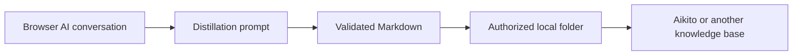

<p align="center">
  <picture>
    <source media="(prefers-color-scheme: dark)" srcset="docs/assets/logo-dark.png">
    <source media="(prefers-color-scheme: light)" srcset="docs/assets/logo-light.png">
    
  </picture>
</p>

<h1 align="center">Chat Distiller</h1>

<p align="center">
  Turn browser-based AI conversations into concise, reusable Markdown notes—saved directly to a local folder you control.
</p>

[](LICENSE)


[简体中文](README.zh-CN.md) · [Privacy Policy](PRIVACY.md) · [Aikito](https://github.com/lsaint/aikito)

Chat Distiller is a Chrome Manifest V3 extension that asks the AI in your
current chat to distill the conversation, validates the structured response,
and saves it as Markdown in a directory you explicitly authorize.

There is no developer-controlled backend, analytics service, or cloud storage.

Chat Distiller works independently with any local Markdown knowledge base. It
is also the browser companion to [Aikito](https://github.com/lsaint/aikito), a
Git-managed workspace for durable AI memory and reusable Agent resources.

Chat Distiller captures valuable knowledge from browser-based AI conversations.
[Aikito](https://github.com/lsaint/aikito) versions, organizes, retrieves, and
reuses that knowledge across projects, sessions, and coding agents.

## TL;DR

Chat Distiller keeps the useful knowledge from an AI conversation without
turning your notes folder into an archive of raw transcripts.

Use a general-purpose exporter when you need a complete transcript. Use Chat
Distiller when you want a concise note containing the decisions, constraints,
insights, and follow-up actions worth reusing.

## Why Chat Distiller

Long AI conversations often contain a small amount of durable knowledge buried
under exploration, repetition, corrections, and temporary context. Copying the
whole transcript preserves everything but makes the result difficult to review
and reuse.

Chat Distiller creates a smaller, structured artifact and saves it directly to
your local knowledge workflow:



## The Gap Between Design and Implementation

Day-to-day software work with AI can often be divided into two broad stages:
design and implementation.

Design here has a broad meaning. It includes architecture, algorithms,
requirements, trade-offs, constraints, and the exploration of possible
solutions—not only visual design.

Implementation is well suited to Coding Agents. They can inspect repositories,
edit files, run tests, verify results, and continue working through concrete
tasks. During design, however, spending a long time discussing ideas directly
with a Coding Agent is not always the best fit.

Design involves exploration: clarifying requirements, comparing approaches,
examining boundaries, challenging assumptions, and repeatedly revising
direction. Browser-based AI Chat products often provide a better environment
for this work. Their typography and reading experience make long text, tables,
diagrams, and multi-turn reasoning easier to follow. Some products allow users
to select a passage and request a targeted revision without rewriting the whole
conversation. Some support branching conversations for exploring multiple
directions, while cross-device continuity and richer history make ongoing
discussions easier to revisit.

Some Chat products also provide built-in memory across conversations, allowing
long-term background, personal preferences, and project context to carry
forward. Keeping brainstorming and design discussions there also preserves
Coding Agent context and usage limits for the work that benefits most from
them: editing code, invoking tools, and completing implementation tasks.

The problem appears when design is complete.

Once a discussion produces useful conclusions, bringing them back into the
local development environment is often awkward. We copy fragments from several
chats, manually assemble a document, save it somewhere, and then ask a Coding
Agent to read it. Full-chat exporters preserve the process, but the transcript
also contains experiments, repetition, misunderstandings, rejected approaches,
and temporary context. Copying everything leaves too much noise; copying only
the final conclusion can lose important constraints and decision rationale.

This creates a natural gap between browser-based AI Chat and local Coding
Agents.

Chat Distiller is designed to bridge that gap. It asks the AI in the current
conversation to extract the durable knowledge worth keeping and organizes
decisions, constraints, insights, and follow-up actions scattered across the
discussion into structured Markdown, then saves it directly to an authorized
local directory.

Design can remain in the Chat interface best suited to thinking and discussion.
Implementation can remain with the Coding Agent best suited to operating on the
project. Chat Distiller connects the two, allowing knowledge accumulated during
design to enter the local workflow in a cleaner, more stable, and reusable form.

## How It Works

1. Authorize a local root directory during first-time setup.
2. Open a supported AI conversation.
3. Select **Generate and save** from the extension popup.
4. Chat Distiller visibly inserts and submits the distillation prompt in the
   current conversation.
5. The AI generates a structured Markdown result, which the extension validates.
6. The background task writes the note to your chosen directory. The default
   subdirectory is `inbox` and can be changed.

You can close the popup after starting a task. Reopening it restores progress.

If saving fails, the compact status card inside the conversation offers a retry
action. When directory permission has expired, the side panel lets you
reauthorize the directory and continue saving.

Chat Distiller records the relationship between a conversation and its saved
file. It avoids duplicate saves when the file still exists and can reuse a
valid result produced with the same prompt when the local file was removed.

## Supported Sites

- ChatGPT

Additional AI chat sites can be added through the Site Adapter interface.

## Installation

### Chrome Web Store

Chrome Web Store release pending review.

### Install from Source

1. Download or clone this repository.
2. Open `chrome://extensions` in Chrome.
3. Enable **Developer mode**.
4. Select **Load unpacked**.
5. Choose the repository directory.
6. Open Chat Distiller and authorize a local root directory.

Chat Distiller requires Chrome 116 or later.

## Works with [Aikito](https://github.com/lsaint/aikito)

Chat Distiller can save Markdown to any local directory you authorize. It also
serves as the browser companion to
[Aikito](https://github.com/lsaint/aikito), a Git-managed workspace for durable
AI memory and reusable Agent resources.

Together, they form a local-first workflow:

```text
Browser AI conversation
        ↓
Chat Distiller
        ↓
Concise Markdown note
        ↓
Aikito workspace
        ↓
Git-versioned memory reused across projects, sessions, and coding agents
```

To use them together, select your
[Aikito](https://github.com/lsaint/aikito) workspace as the authorized root
directory. Chat Distiller saves new notes to `inbox/` by default, where they
can be reviewed and organized into the appropriate global or project memory
scope.

[Aikito](https://github.com/lsaint/aikito) is optional. Chat Distiller works
with Obsidian vaults, Git repositories, and other local Markdown knowledge
bases without requiring additional software.

## Local-First by Design

- Generated Markdown is written only to the directory you select.
- Settings, recovery state, conversation identifiers, and prompt fingerprints
  stay in Chrome extension storage.
- The selected directory handle stays in browser-managed IndexedDB.
- Chat content is not uploaded to a developer-controlled server.
- The only AI request is the prompt visibly submitted to the supported chat
  service already hosting the conversation.

See the [Privacy Policy](PRIVACY.md) for the complete data-handling details.
See [Local Storage and Privacy](docs/local-storage-and-privacy.md) for the
storage model and trust boundaries.

## Permissions

Chat Distiller requests only the permissions needed for its local-first
workflow:

- `storage` stores settings, recovery state, conversation identifiers, and
  prompt fingerprints.
- `alarms` lets the background worker recover active tasks and enforce timeouts.
- `sidePanel` keeps directory authorization available while Chrome's folder
  picker is open and allows recovery flows to reopen the authorization UI.
- Host permissions allow Chat Distiller to interact only with explicitly
  supported HTTPS AI chat pages declared in the manifest.

Review `manifest.json` for the exact permission list used by the current
release.

## Design Choices

- **Distillation, not full export.** The default prompt keeps reusable knowledge
  instead of reproducing the entire transcript.
- **A strict output protocol.** The response must contain start and end markers,
  one outer four-backtick fence, and a lowercase kebab-case filename. Incomplete
  output is rejected rather than silently saved.
- **No generated timestamp in the note body.** The note focuses on the knowledge
  itself; filenames and filesystem metadata can carry operational timing.
- **Compact conversation UI.** The distillation prompt and generated response
  collapse into a status card with an explicit option to reveal the content.
- **No silent overwrite.** Filename collisions receive a numeric suffix.
- **User-visible automation.** Prompt insertion and submission happen in the
  active chat and only after a user action.

## Usage Details

The default save location under the authorized root directory is:

```text
inbox
```

The popup can override the subdirectory for the current save. The side panel
controls the default subdirectory and root directory.

If no filename is entered, Chat Distiller uses the validated English filename
returned by the AI, with a time-and-title fallback where needed.

The `sidePanel` permission keeps directory authorization UI alive while Chrome's
folder picker has focus and lets an error card reopen the authorization flow.

Host permissions are limited to the supported HTTPS chat origins declared in
the manifest.

## Internationalization

The extension supports English and Simplified Chinese. Chrome locales matching
`zh-*` use Simplified Chinese; other locales use English.

Manifest text, popup and side-panel UI, status cards, and runtime messages use
Chrome i18n resources.

The default distillation prompt follows the interface language. Once edited, a
custom prompt is preserved across extension upgrades and language changes until
the user selects **Reset to default**.

## Known Limitations

- AI chat pages do not expose a stable extension API. Site DOM changes can
  temporarily break selectors for messages, editors, or send controls.
- Very long generations can exceed the task timeout.
- Clearing extension data, uninstalling the extension, moving the selected
  directory, or changing system permissions can require directory
  reauthorization.
- A response missing the required filename or completion marker is intentionally
  rejected as incomplete.
- ChatGPT is currently the only bundled site adapter.

See [Troubleshooting](docs/troubleshooting.md) for recovery steps and common
failure modes.

## Architecture

The content layer uses a **Site Adapter** architecture. Shared protocol,
state-machine, DOM utility, and card UI code is separated from site-specific
selectors and editor behavior.

Read the [Architecture](docs/architecture.md) guide for component boundaries,
task ownership, and the output protocol. To add another AI chat platform, use
the [Site Adapter Guide](docs/site-adapters.md).

## Documentation

- [Documentation index](docs/README.md)
- [Architecture](docs/architecture.md)
- [Site Adapter Guide](docs/site-adapters.md)
- [Local Storage and Privacy](docs/local-storage-and-privacy.md)
- [Troubleshooting](docs/troubleshooting.md)

## Contributing

Issues and pull requests are welcome.

When adding a new site adapter, keep permissions limited to the narrowest
supported HTTPS origin and avoid duplicating shared protocol or state-machine
logic in site-specific code.

## License

Chat Distiller is licensed under the [MIT License](LICENSE).
