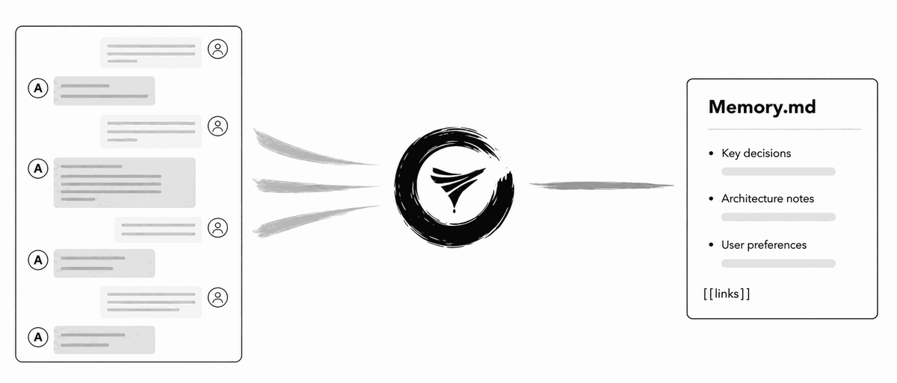
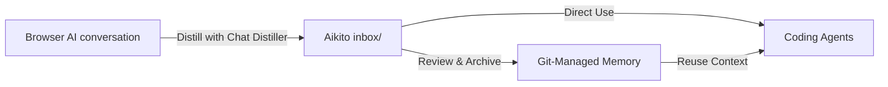

  <picture>
    <source media="(prefers-color-scheme: dark)" srcset="docs/assets/logo-dark.png">
    <source media="(prefers-color-scheme: light)" srcset="docs/assets/logo-light.png">
    
  </picture>

<h1 align="center">Chat Distiller</h1>

  Distill browser AI conversations into concise, reusable Markdown memory—saved directly to a local folder you control.

[Install from Chrome Web Store](https://chromewebstore.google.com/detail/chat-distiller/jmnnlhpgihkbffhlkhemmbldajnfoalm) ·
[GitHub Releases](https://github.com/lsaint/chat-distiller/releases/latest) ·
[简体中文](README.zh-CN.md) · [Privacy Policy](PRIVACY.md) ·
[Aikito](https://github.com/lsaint/aikito)

Chat Distiller is a Chrome Manifest V3 extension that asks the AI in your current chat to distill the conversation, validates the structured response, and saves it as Markdown to a directory you explicitly authorize.

There is no developer-controlled backend, analytics service, or cloud storage. It works independently with any local Markdown directory (Obsidian, Git repos, or local folders), and can also companion with [Aikito](https://github.com/lsaint/aikito).

  

## Why Chat Distiller

General-purpose exporters capture full transcripts, but long AI conversations often bury key decisions under exploration and temporary context. Chat Distiller asks the AI to distill the conversation into a concise Markdown note—containing only reusable decisions, constraints, insights, and action items—and saves it directly to your local workspace. See [Why Chat Distiller](docs/why-chat-distiller.md) for the full background.

| Raw Conversation (Before) | Concise Memory Note (After) |
| --- | --- |
| **Noisy & Verbose**: Full transcript containing exploration, trial-and-error, repetition, and temporary debugging context. | **Clean & Reusable**: Structured Markdown note written directly to your authorized local folder. |
| **High Overhead**: Hard to review manually and wastes context tokens when fed back to Coding Agents. | **High Signal**: Contains only **Decisions & Rationale**, **Architectural Constraints**, **Rejected Alternatives**, and **Follow-up Actions**. |

## How It Works

1. Authorize a local root directory during first-time setup.
2. Open a supported AI conversation.
3. Select **Generate and save** from the extension popup (optionally specifying a custom subdirectory or filename).
4. Chat Distiller visibly inserts and submits the distillation prompt in the current conversation.
5. The AI generates a structured Markdown result, which the extension validates.
6. The background task writes the note to your directory (defaults to `inbox/`). If no filename is entered, it uses the AI-generated filename, falling back to a time-and-title format.

You can close the popup after starting a task; reopening it restores progress. If saving fails, the conversation status card offers a retry option, and the side panel lets you reauthorize expired directory permissions.

Chat Distiller records saved conversation metadata to prevent duplicate saves and can reuse existing valid prompt results.

## Supported Sites

- ChatGPT

Additional AI chat sites can be added through the Site Adapter interface.

## Installation

### Option 1: Chrome Web Store (Recommended)

[Install Chat Distiller from the Chrome Web Store](https://chromewebstore.google.com/detail/chat-distiller/jmnnlhpgihkbffhlkhemmbldajnfoalm).

### Option 2: Install from GitHub Release

1. Open the [latest GitHub Release](https://github.com/lsaint/chat-distiller/releases/latest).
2. Under **Assets**, download `chat-distiller-*.zip`. Do not download the automatically generated **Source code** archives.
3. Extract the downloaded ZIP.
4. Open `chrome://extensions` in Chrome and enable **Developer mode**.
5. Select **Load unpacked** and choose the extracted directory.
6. Open Chat Distiller and authorize a local root directory.

Each GitHub Release also provides a `.sha256` file for verifying the extension archive. The release ZIP contains the same runtime files as the corresponding Chrome Web Store submission package.

### Option 3: Install from Source

1. Clone this repository.
2. Open `chrome://extensions` in Chrome and enable **Developer mode**.
3. Select **Load unpacked** and choose the repository directory.
4. Open Chat Distiller and authorize a local root directory.

Chat Distiller requires Chrome 116 or later.

## Works with [Aikito](https://github.com/lsaint/aikito)

To use Chat Distiller with [Aikito](https://github.com/lsaint/aikito), select your Aikito workspace as the authorized root directory. New notes will be saved to `inbox/` by default, ready for review and organization into durable memory.

## Privacy & Permissions

Chat Distiller operates strictly locally with zero external tracking servers:

- **Local Files & Storage**: Generated Markdown is written only to your authorized folder. Settings, task state, and prompt fingerprints stay in Chrome extension storage (`storage` permission), while directory handles remain in local IndexedDB.
- **No Third-Party Backend**: Chat content is never uploaded to external servers. The only AI request is the prompt submitted in your active browser chat session (`host_permissions` limited strictly to supported HTTPS chat origins).
- **Background Tasks & Side Panel**: Uses `alarms` to recover pending tasks/timeouts and `sidePanel` to maintain directory authorization flows during folder selection.

See our [Privacy Policy](PRIVACY.md) and [Local Storage and Privacy](docs/local-storage-and-privacy.md) for full details.

## Design Choices

- **Distillation, not full export.** The default prompt keeps reusable knowledge instead of reproducing the entire transcript.
- **A strict output protocol.** The response must contain start and end markers, one outer four-backtick fence, and a lowercase kebab-case filename. Incomplete output is rejected rather than silently saved.
- **No generated timestamp in the note body.** The note focuses on the knowledge itself; filenames and filesystem metadata can carry operational timing.
- **Compact conversation UI.** The distillation prompt and generated response collapse into a status card with an explicit option to reveal the content.
- **No silent overwrite.** Filename collisions receive a numeric suffix.
- **User-visible automation.** Prompt insertion and submission happen in the active chat and only after a user action.

## Internationalization

The extension supports English and Simplified Chinese. Chrome locales matching `zh-*` use Simplified Chinese; other locales use English.

Manifest text, popup and side-panel UI, status cards, and runtime messages use Chrome i18n resources.

The default distillation prompt follows the interface language. Once edited, a custom prompt is preserved across extension upgrades and language changes until the user selects **Reset to default**.

## Known Limitations

- AI chat pages do not expose a stable extension API. Site DOM changes can temporarily break selectors for messages, editors, or send controls.
- Very long generations can exceed the task timeout.
- Clearing extension data, uninstalling the extension, moving the selected directory, or changing system permissions can require directory reauthorization.
- A response missing the required filename or completion marker is intentionally rejected as incomplete.
- ChatGPT is currently the only bundled site adapter.

See [Troubleshooting](docs/troubleshooting.md) for recovery steps and common failure modes.

## Architecture

The content layer uses a **Site Adapter** architecture. Shared protocol, state-machine, DOM utility, and card UI code is separated from site-specific selectors and editor behavior.

Read the [Architecture](docs/architecture.md) guide for component boundaries, task ownership, and the output protocol. To add another AI chat platform, use the [Site Adapter Guide](docs/site-adapters.md).

## Documentation

- [Documentation index](docs/README.md)
- [Why Chat Distiller](docs/why-chat-distiller.md)
- [Architecture](docs/architecture.md)
- [Site Adapter Guide](docs/site-adapters.md)
- [Local Storage and Privacy](docs/local-storage-and-privacy.md)
- [Troubleshooting](docs/troubleshooting.md)

## Contributing

Issues and pull requests are welcome.

When adding a new site adapter, keep permissions limited to the narrowest supported HTTPS origin and avoid duplicating shared protocol or state-machine logic in site-specific code.

## License

Chat Distiller is licensed under the [MIT License](LICENSE).
