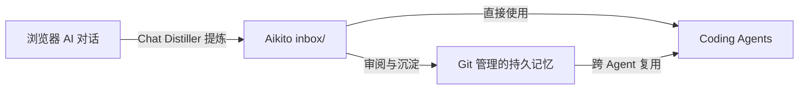

  <picture>
    <source media="(prefers-color-scheme: dark)" srcset="docs/assets/logo-dark.png">
    <source media="(prefers-color-scheme: light)" srcset="docs/assets/logo-light.png">
    
  </picture>

<h1 align="center">Chat Distiller</h1>

  将浏览器中的 AI 对话转化为简洁、可复用的 Markdown 笔记，并直接保存到你掌控的本地目录。

[从 Chrome 应用商店安装](https://chromewebstore.google.com/detail/chat-distiller/jmnnlhpgihkbffhlkhemmbldajnfoalm) ·
[GitHub Releases](https://github.com/lsaint/chat-distiller/releases/latest) ·
[English](README.md) · [隐私政策](PRIVACY.md) ·
[Aikito](https://github.com/lsaint/aikito)

Chat Distiller 是一个 Chrome Manifest V3 扩展。它会请求当前对话中的 AI 提炼聊天内容，校验结构化回复，并将结果作为 Markdown 保存到你明确授权的本地目录。

它没有开发者控制的后端、分析服务或云存储。它可以独立配合任意本地 Markdown 目录（如 Obsidian Vault、Git 仓库等）使用，也可作为 [Aikito](https://github.com/lsaint/aikito) 的浏览器端配套工具。

  

## 为什么需要 Chat Distiller

通用导出工具保存的是完整的聊天记录，而长对话中往往夹杂着大量的试探、纠错与临时上下文。Chat Distiller 请求 AI 将对话提炼为只保留可复用决策、约束、洞察与行动项的 Markdown 笔记，并直接写入本地工作区。完整设计思考请参阅[为什么需要 Chat Distiller](docs/why-chat-distiller.zh-CN.md)。

| 提炼前的原始对话 (Before)                                                            | 提炼后的 Markdown 笔记 (After)                                                          |
| ------------------------------------------------------------------------------------ | --------------------------------------------------------------------------------------- |
| **冗长且杂乱**：包含试探、重复、误解、被否定的临时方案和调优上下文的完整聊天记录。   | **干净且可复用**：直接写入授权本地目录的结构化 Markdown 笔记。                          |
| **阅读成本高**：人工审阅费时，作为 Prompt 喂给 Coding Agent 会浪费大量上下文 Token。 | **高信息密度**：仅保留 **决策及依据**、**架构约束**、**被否定的方案** 与 **后续行动**。 |

## 工作方式

1. 首次使用时授权一个本地根目录。
2. 打开受支持的 AI 对话。
3. 在扩展 Popup 中选择“生成并保存”（可临时指定子目录或自定义文件名）。
4. Chat Distiller 在当前对话中可见地填入并提交提炼提示词。
5. AI 生成结构化 Markdown，扩展对结果进行校验。
6. 后台任务把笔记写入所选目录（默认为 `inbox/`）。若文件名留空，则使用 AI 生成的文件名，必要时回退为时间与标题组合。

任务启动后可以关闭 Popup，再次打开时恢复进度。若保存失败或权限失效，可通过对话内状态卡片重试或通过侧边栏重新授权。

Chat Distiller 会记录对话与文件的关联状态，防止重复保存，并在文件被删时复用已有的有效结果。

## 支持的站点

- ChatGPT
- DeepSeek
- Gemini
- 豆包 (Doubao)

其他 AI 对话站点可以通过 Site Adapter 接口扩展。

## 安装

### 选项 1：Chrome 应用商店（推荐）

[从 Chrome 应用商店安装 Chat Distiller](https://chromewebstore.google.com/detail/chat-distiller/jmnnlhpgihkbffhlkhemmbldajnfoalm)。

### 选项 2：从 GitHub Release 安装

1. 打开[最新 GitHub Release](https://github.com/lsaint/chat-distiller/releases/latest)。
2. 在 **Assets** 区域下载 `chat-distiller-*.zip`。不要下载 GitHub 自动生成的 **Source code** 源码压缩包。
3. 解压下载的 ZIP。
4. 在 Chrome 中打开 `chrome://extensions`，并开启“开发者模式”。
5. 点击“加载已解压的扩展程序”，选择解压后的目录。
6. 打开 Chat Distiller 并授权一个本地根目录。

每个 GitHub Release 还会提供用于校验扩展压缩包的 `.sha256` 文件。Release ZIP 与对应的 Chrome Web Store 送审包包含相同的运行时文件。

### 选项 3：从源码安装

1. 克隆本仓库。
2. 在 Chrome 中打开 `chrome://extensions`，并开启“开发者模式”。
3. 点击“加载已解压的扩展程序”，选择仓库目录。
4. 打开 Chat Distiller 并授权一个本地根目录。

Chat Distiller 要求 Chrome 116 或更高版本。

## 与 [Aikito](https://github.com/lsaint/aikito) 配合使用

搭配 [Aikito](https://github.com/lsaint/aikito) 使用时，只需将 Aikito 工作区选为授权根目录。扩展默认将新笔记保存至 `inbox/`，方便审阅并归档为持久记忆。

## 隐私与权限

Chat Distiller 遵循完全本地化的设计，没有任何云端追踪服务器：

- **本地存储与写入**：生成的 Markdown 仅写入你授权的本地目录。设置、任务状态与提示词指纹保存在扩展本地存储（`storage` 权限），目录句柄存放在本地 IndexedDB。
- **无第三方后端**：聊天内容绝不上传至任何开发者服务器。唯一的 AI 请求是在你当前的浏览器 AI 对话中提交提示词（`host_permissions` 仅限于 Manifest 声明的受支持 AI 站点）。
- **后台与侧边栏**：使用 `alarms` 恢复任务与超时控制；使用 `sidePanel` 在选择文件夹及重新授权时保持界面交互。

完整细节请参阅[隐私政策](PRIVACY.md)与[本地存储与隐私](docs/local-storage-and-privacy.md)。

## 设计选择

- **提炼，而非完整导出。** 默认提示词保留可复用知识，不复制完整聊天记录。
- **严格的输出协议。** 回复必须包含开始与结束标记、一个四反引号外层围栏，以及小写 kebab-case 英文文件名；不完整结果会被拒绝，而不是静默保存。
- **正文不生成时间戳。** 笔记聚焦知识本身，文件名和文件系统元数据可以承载操作时间。
- **紧凑的对话 UI。** 提炼提示词和生成回复会折叠为状态卡片，并提供明确的内容展开入口。
- **不静默覆盖。** 文件名冲突时自动追加数字后缀。
- **用户可见的自动化。** 只有用户主动操作后，扩展才会在当前页面填入并提交提示词。

## 国际化

扩展支持英文和简体中文。Chrome locale 匹配 `zh-*` 时使用简体中文，其他 locale 使用英文。

Manifest 文本、Popup、侧边栏、页面状态卡片和运行时消息均通过 Chrome i18n 资源渲染。

默认提炼提示词跟随界面语言。用户编辑后的自定义提示词会在扩展升级和语言切换后继续保留，直到用户选择“重置默认”。

## 架构

Content 层采用 **Site Adapter** 架构。共享协议、状态机、DOM 工具和卡片 UI 与站点专属的选择器及编辑器行为彼此分离。

组件边界、任务生命周期和输出协议见[架构文档](docs/architecture.md)。如需增加其他 AI Chat 平台，请参阅 [Site Adapter 指南](docs/site-adapters.md)。

## 文档

- [文档索引](docs/README.md)
- [为什么需要 Chat Distiller](docs/why-chat-distiller.zh-CN.md)
- [架构](docs/architecture.md)
- [Site Adapter 指南](docs/site-adapters.md)
- [本地存储与隐私](docs/local-storage-and-privacy.md)
- [故障排查](docs/troubleshooting.md)

## 贡献

欢迎提交 Issue 和 Pull Request。

新增站点适配器时，请把权限限制在所需的最小 HTTPS 来源范围内，并避免在站点专属代码中重复实现共享协议或状态机逻辑。

## 支持

如果你觉得 Chat Distiller 对你有帮助，可以[支持它的开发](https://lsaint.github.io/donation/?utm_source=github&utm_medium=readme&utm_campaign=chat-distiller)。
