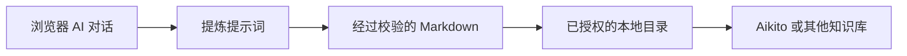

<p align="center">
  <picture>
    <source media="(prefers-color-scheme: dark)" srcset="docs/assets/logo-dark.png">
    <source media="(prefers-color-scheme: light)" srcset="docs/assets/logo-light.png">
    
  </picture>
</p>

<h1 align="center">Chat Distiller</h1>

<p align="center">
  将浏览器中的 AI 对话转化为简洁、可复用的 Markdown 笔记，并直接保存到你掌控的本地目录。
</p>

[](LICENSE)


[下载扩展](https://github.com/lsaint/chat-distiller/releases/latest) ·
[English](README.md) · [隐私政策](PRIVACY.md) ·
[Aikito](https://github.com/lsaint/aikito)

Chat Distiller 是一个 Chrome Manifest V3 扩展。它会请求当前对话中的
AI 提炼聊天内容，校验结构化回复，并将结果作为 Markdown 保存到你明确授权的目录。

它没有开发者控制的后端、分析服务或云存储。

Chat Distiller 可以独立配合任何本地 Markdown 知识库使用。它也是
[Aikito](https://github.com/lsaint/aikito) 的浏览器端配套工具；
[Aikito](https://github.com/lsaint/aikito) 是一个通过 Git 管理持久 AI 记忆与可复用
Agent 资源的工作区。

Chat Distiller 从浏览器 AI 对话中采集有价值的知识；
[Aikito](https://github.com/lsaint/aikito) 则负责对这些知识进行版本管理、组织、检索，
并让它们在不同项目、会话和 Coding Agent 之间复用。

## 简而言之

Chat Distiller 保留 AI 对话中真正有用的知识，而不会把你的笔记目录变成原始聊天记录仓库。

需要完整聊天记录时，请使用通用导出工具；需要一篇简洁笔记，保留值得复用的决策、约束、
洞察和后续行动时，请使用 Chat Distiller。

## 为什么需要 Chat Distiller

一段很长的 AI 对话通常只有少量内容值得长期保留，其余是探索、重复、修正和临时上下文。
完整复制聊天虽然没有遗漏，却会让结果难以审阅和复用。

Chat Distiller 会生成更小、更结构化的成果，并把它直接送入你的本地知识工作流：



## 设计与实施之间的鸿沟

日常使用 AI 进行软件开发时，工作通常可以分为两个阶段：设计与实施。

设计阶段指的是广义上的设计，不单只是美术设计，比如架构设计，算法设计等等。

实施阶段适合交给 Coding Agent。它可以读取代码、修改文件、运行测试、检查结果，并持续推进具体任务。但在设计阶段，直接在 Coding Agent 中进行长时间讨论，未必是最合适的选择。

设计往往包含大量探索：澄清需求、比较方案、推演边界、质疑假设、反复修正方向。网页端的 AI Chat 通常更适合承载这些工作。它具备更清晰的排版与阅读体验，能够更自然地呈现长文本、表格、图示以及多轮推理过程；部分产品还支持对 AI 输出内容进行局部选中与定向编辑，用户可以直接针对某一段落或某一句话发起修改，而无需重写整段对话；部分产品支持分支对话，便于同时探索不同方向；桌面端与移动端可以无缝衔接；历史记录的浏览与检索也通常更加完整。

一些 Chat 产品还提供跨会话的内置 Memory，使长期背景、个人偏好和项目上下文能够自然延续。把头脑风暴和方案讨论放在这里，也可以避免大量消耗 Coding Agent 的使用额度，让 Agent 的上下文和配额更多地用于真正需要操作代码、运行工具和完成实施的环节。

问题出现在设计完成之后。

当讨论逐渐形成有价值的结论，我们通常需要把这些内容带回本地开发环境。但这个过程往往十分笨拙：从不同聊天中复制片段，手工整理成文档，保存到某个目录，再告诉 Coding Agent 去读取它。市面上有很多保存整个聊天过程的插件，但原始对话里还混杂着试探、重复、误解、被否定的方案和临时上下文。完整复制会留下大量噪声，只复制最终结论又容易遗漏重要约束与决策依据。

于是，网页 Chat 与本地 Coding Agent 之间形成了一道天然的鸿沟。

Chat Distiller 正是为填补这道鸿沟而设计。它让当前对话中的 AI 主动提炼长期有价值的内容，将散落在多轮交流中的结论、约束、洞察和后续行动整理成结构清晰的 Markdown，并直接保存到用户授权的本地目录。

设计可以继续发生在更适合思考和交流的 Chat 页面中，实施可以继续交给更擅长操作项目的 Coding Agent。Chat Distiller 负责把两者连接起来，让设计阶段积累的知识能够以更干净、更稳定、更容易复用的形式一键存进本地工作流。

## 工作方式

1. 首次使用时授权一个本地根目录。
2. 打开受支持的 AI 对话。
3. 在扩展 Popup 中选择“生成并保存”。
4. Chat Distiller 在当前对话中可见地填入并提交提炼提示词。
5. AI 生成结构化 Markdown，扩展对结果进行校验。
6. 后台任务把笔记写入所选目录；默认子目录为 `inbox`，可以修改。

任务启动后可以关闭 Popup，再次打开时会恢复进度。

保存失败时，对话内的紧凑状态卡片会提供重试操作。目录权限失效时，可以通过侧边栏重新授权
目录并继续保存。

Chat Distiller 会记录对话与已保存文件的关系。文件仍然存在时，它会避免重复保存；如果本地
文件已被删除，而现有结果由相同提示词生成且协议有效，它可以直接复用该结果。

## 支持的站点

- ChatGPT

其他 AI 对话站点可以通过 Site Adapter 接口扩展。

## 安装

### Chrome Web Store

Chrome Web Store 版本正在等待审核。

### 从 GitHub Release 安装

1. 打开[最新 GitHub Release](https://github.com/lsaint/chat-distiller/releases/latest)。
2. 在 **Assets** 区域下载 `chat-distiller-*.zip`。不要下载 GitHub 自动生成的
   **Source code** 源码压缩包。
3. 解压下载的 ZIP。
4. 在 Chrome 中打开 `chrome://extensions`，并开启“开发者模式”。
5. 点击“加载已解压的扩展程序”，选择解压后的目录。
6. 打开 Chat Distiller 并授权一个本地根目录。

每个 GitHub Release 还会提供用于校验扩展压缩包的 `.sha256` 文件。Release ZIP 与对应的
Chrome Web Store 送审包包含相同的运行时文件。

### 从源码安装

1. 克隆本仓库。
2. 在 Chrome 中打开 `chrome://extensions`，并开启“开发者模式”。
3. 点击“加载已解压的扩展程序”，选择仓库目录。
4. 打开 Chat Distiller 并授权一个本地根目录。

Chat Distiller 要求 Chrome 116 或更高版本。

## 与 [Aikito](https://github.com/lsaint/aikito) 配合使用

Chat Distiller 可以把 Markdown 保存到你授权的任意本地目录。它也可以作为
[Aikito](https://github.com/lsaint/aikito) 的浏览器端配套工具：

```text
浏览器 AI 对话
        ↓
Chat Distiller
        ↓
简洁的 Markdown 笔记
        ↓
Aikito 工作区
        ↓
通过 Git 管理，并在不同项目、会话和 Coding Agent 之间复用
```

将 [Aikito](https://github.com/lsaint/aikito) 工作区选为授权根目录即可组合使用。
Chat Distiller 默认把新笔记保存到 `inbox/`，你可以在那里审阅内容，再将其整理到适当的
全局或项目 memory scope。

[Aikito](https://github.com/lsaint/aikito) 不是必需依赖。Chat Distiller 也适用于
Obsidian Vault、Git 仓库和其他本地 Markdown 知识库。

## 本地优先设计

- 生成的 Markdown 只会写入你选择的目录。
- 设置、恢复状态、对话标识和提示词指纹保存在 Chrome 扩展存储中。
- 所选目录的 handle 保存在浏览器管理的 IndexedDB 中。
- 对话内容不会上传到开发者控制的服务器。
- 唯一的 AI 请求，是向当前承载这段对话的网站可见地提交提炼提示词。

完整的数据处理说明见[隐私政策](PRIVACY.md)，存储模型与信任边界见
[本地存储与隐私](docs/local-storage-and-privacy.md)。

## 权限

Chat Distiller 只申请本地优先工作流所需的权限：

- `storage`：保存设置、恢复状态、对话标识和提示词指纹。
- `alarms`：唤醒后台 worker，以恢复任务并执行超时控制。
- `sidePanel`：在 Chrome 文件夹选择器打开时保持目录授权界面，并允许恢复流程重新打开
  授权 UI。
- Host permissions：只允许扩展与 manifest 中明确声明的受支持 HTTPS AI Chat 页面交互。

当前版本的准确权限列表以 `manifest.json` 为准。

## 设计选择

- **提炼，而非完整导出。** 默认提示词保留可复用知识，不复制完整聊天记录。
- **严格的输出协议。** 回复必须包含开始与结束标记、一个四反引号外层围栏，以及小写
  kebab-case 英文文件名；不完整结果会被拒绝，而不是静默保存。
- **正文不生成时间戳。** 笔记聚焦知识本身，文件名和文件系统元数据可以承载操作时间。
- **紧凑的对话 UI。** 提炼提示词和生成回复会折叠为状态卡片，并提供明确的内容展开入口。
- **不静默覆盖。** 文件名冲突时自动追加数字后缀。
- **用户可见的自动化。** 只有用户主动操作后，扩展才会在当前页面填入并提交提示词。

## 使用细节

已授权根目录下的默认保存位置为：

```text
inbox
```

Popup 可以为本次保存覆盖子目录，侧边栏控制默认子目录与根目录。

文件名留空时，Chat Distiller 使用 AI 返回且经过校验的英文文件名；必要时回退为时间和标题
组合生成的文件名。

`sidePanel` 权限让目录授权 UI 在 Chrome 文件夹选择器获得焦点时保持存活，也让异常状态卡片
可以重新打开授权流程。

Host permissions 仅覆盖 manifest 中声明的受支持 HTTPS Chat 来源。

## 国际化

扩展支持英文和简体中文。Chrome locale 匹配 `zh-*` 时使用简体中文，其他 locale 使用英文。

Manifest 文本、Popup、侧边栏、页面状态卡片和运行时消息均通过 Chrome i18n 资源渲染。

默认提炼提示词跟随界面语言。用户编辑后的自定义提示词会在扩展升级和语言切换后继续保留，
直到用户选择“重置默认”。

## 已知限制

- AI Chat 页面没有面向扩展的稳定 API，站点 DOM 变化可能暂时破坏消息、编辑器或发送控件
  的选择器。
- 很长的生成过程可能超过任务超时限制。
- 清理扩展数据、卸载扩展、移动所选目录或修改系统权限后，可能需要重新授权目录。
- 缺少必要文件名或完成标记的回复会被有意判定为不完整并拒绝保存。
- 当前只有 ChatGPT 内置站点适配器。

常见故障模式与恢复步骤见[故障排查](docs/troubleshooting.md)。

## 架构

Content 层采用 **Site Adapter** 架构。共享协议、状态机、DOM 工具和卡片 UI 与站点专属的
选择器及编辑器行为彼此分离。

组件边界、任务生命周期和输出协议见[架构文档](docs/architecture.md)。如需增加其他 AI Chat
平台，请参阅 [Site Adapter 指南](docs/site-adapters.md)。

## 文档

- [文档索引](docs/README.md)
- [架构](docs/architecture.md)
- [Site Adapter 指南](docs/site-adapters.md)
- [本地存储与隐私](docs/local-storage-and-privacy.md)
- [故障排查](docs/troubleshooting.md)

## 贡献

欢迎提交 Issue 和 Pull Request。

新增站点适配器时，请把权限限制在所需的最小 HTTPS 来源范围内，并避免在站点专属代码中
重复实现共享协议或状态机逻辑。

## 许可证

Chat Distiller 使用 [MIT License](LICENSE)。
